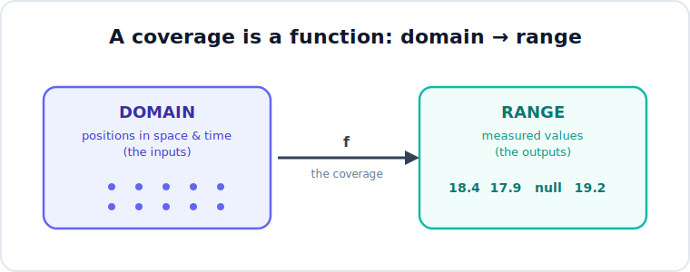
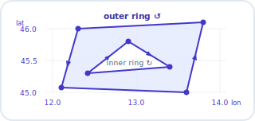

This guide is for people new to *CoverageJSON* (often shortened
to *CovJSON*) who need to understand what it is, why it exists, and how to read a
CovJSON document, starting from no prior knowledge of geospatial data formats. It assumes
you can read JSON (JavaScript Object Notation, the familiar `{ "key": "value" }`
text format) and nothing else. The geospatial ideas it relies on are introduced
as they come up and explained just far enough to read CoverageJSON with
confidence. Think of it as a practical on-ramp rather than a deep course in
geospatial science: enough to follow along comfortably, with pointers to the
specification whenever you want to go further.

We will move in four stages:

1. **Why** CoverageJSON exists and what problem it solves.
2. The **foundational geospatial concepts** the format is built on.
3. The **core CoverageJSON concepts** themselves.
4. A few **deeper dives** and **worked examples** that turn the theory into
   something concrete.

You do not need to read it all at once. The first three stages give you a
working understanding; the rest is there when you want to go deeper.

## Why CoverageJSON exists, and why it matters {#sec-why}

### The problem: putting environmental data on the web {#sec-problem}

A huge amount of the world's data describes *how some quantity varies over space
and time*. The air temperature across a country at 2:00 p.m. Tuesday. The
elevation of the ground, meter by meter, across a mountain range. The category
of land cover (forest, water, cropland, urban) in each square kilometer of a
continent. A 10-day forecast of rainfall over an ocean. These are not lists of
separate "things": they are *fields* of values blanketing a region, sampled at
many positions.

People who work with this kind of data want to do something that sounds simple:
show it in a web browser, let a user click a point to read its value, drag a box
to download a region, or step through time. Doing that well turns out to be
hard, because the formats that traditionally hold this data were not designed for
the web.

### What came before, and why it chafes in a browser {#sec-before}

The formats that hold and move this data fall into a few distinct roles, and
separating those roles (storing the data, delivering it, and, more recently,
streaming it from the cloud) makes plain exactly what was still missing, and why a
format like CoverageJSON was needed.

**Storage formats: how field data sits on disk.** For decades, scientific "field"
data has lived in a handful of specialized formats built to hold large arrays of
numbers compactly for analysis software, not for browsers.

[**NetCDF**](https://www.unidata.ucar.edu/software/netcdf/) (Network Common Data
Form), maintained by Unidata, is the workhorse of the earth sciences. It stores
large, multi-dimensional arrays of numbers (picture a stack of temperature grids,
one per hour) in a single *self-describing* binary file, meaning the file carries
its own description of its dimensions, variables, and units. It is
superb for analysis on a workstation, but it is binary: a browser cannot open it,
and reading a value out requires a dedicated software library.

Closely related is the [**HDF**](https://www.hdfgroup.org/) (Hierarchical Data
Format) family from The HDF Group. The older
[**HDF4**](https://www.hdfgroup.org/solutions/hdf4/) traces back to the late
1980s and still turns up in legacy satellite archives; its successor
[**HDF5**](https://www.hdfgroup.org/solutions/hdf5/) (version 5, released in 1998)
is a general-purpose binary container for large scientific datasets and is widely
used in its own right. The two are not compatible with each other, but the link
to NetCDF is direct: NetCDF's modern version, NetCDF-4, is built on top of HDF5.
All of these formats share NetCDF's analytical strengths and its
web-unfriendliness.

[**GRIB**](https://community.wmo.int/en/activity-areas/wis/grib-edition-1)
(GRIdded Binary), standardized by the World Meteorological Organization (WMO), is
the format in which the world's weather agencies exchange forecasts. It is even
more compact than NetCDF, using specialized encoding to squeeze global model
output down to a size that can be transmitted efficiently. That compactness comes
at the cost of approachability: GRIB is dense, highly encoded binary that, in
practice, requires dedicated software to decode.

[**GeoTIFF**](https://www.ogc.org/standards/geotiff/) comes instead from the
imagery and mapping world: it is the ubiquitous TIFF image format extended with
tags that record where on the Earth each pixel sits. It is the default for
satellite scenes, aerial photography, and elevation models, and it is what most
people picture when they say "raster file." Like the others it is binary, and a
plain GeoTIFF must be downloaded in full before any of it can be read.

**Delivery standards: how the data is served over a network.** Storing data is
only half the job; the other half is answering a client's request for part of it.
Here the established OGC standard was the
[**Web Coverage Service**](https://www.ogc.org/standards/wcs/) (WCS). WCS lets a
client request coverage data over HTTP, but it, and its companion encoding the
[**Geography Markup Language**](https://www.ogc.org/standards/gml/) (GML), are
built on XML and are notably verbose and intricate. They are rigorous and
capable, yet consuming them from JavaScript in a browser means writing a great
deal of plumbing for comparatively little payoff.

**Cloud-native variants: storage made web-retrievable.** More recent formats
narrow the distance between storage and the browser. A
[**Cloud-Optimized GeoTIFF**](https://www.cogeo.org/) (COG) rearranges a GeoTIFF
so a client can fetch just the bytes it needs over HTTP, and
[**Zarr**](https://zarr.dev/) does the same for the multi-dimensional arrays of
the NetCDF and HDF world. These are genuine advances: a browser can now pull data
straight from them.

**The remaining gap: meaning, in a web-native shape.** These storage formats are
not short on metadata; NetCDF and its kin already embed dimensions, units, and
coordinates inside the file, which is what "self-describing" meant above. The gap
is the *form* that description takes. Even the cloud-native pair hands a browser
raw *bytes and arrays* whose meaning is locked in a binary container or a
format-specific convention, reachable only through specialized libraries. None
delivers the data as plain JSON that a web client parses directly, with each
quantity's units, coordinates, and identity attached as shared, resolvable web
identifiers (the unit codes, coordinate-system URIs, and vocabulary links we meet
in later sections) that software can match across datasets. That web-native,
linked-meaning layer is precisely what CoverageJSON adds, and it is the reason the
format exists.

### Why JSON, and why GeoJSON is not enough {#sec-why-json}

Meanwhile, [JSON](https://www.json.org/) had become the default language of the
web. It is text, every browser parses it for free, and humans can read it. For
*vector* geographic data (points, lines, and polygons such as city locations,
roads, and country boundaries), the web already had a beloved JSON format:
[**GeoJSON**](https://geojson.org/). GeoJSON is simple and ubiquitous, and if you
have seen any web map, you have probably seen GeoJSON behind it.

But GeoJSON describes *discrete features*: "here is a point, here is its name."
It has no good way to express a dense, regular *field* of values: a million
temperature readings laid out on a grid, each tied to a precise location and
time, possibly with some cells missing. You can force such data into GeoJSON, but
it becomes bloated and loses the structure (the grid, the axes, the units) that
makes the data meaningful and efficient to handle.

That structural gap (JSON-native and web-friendly, yet built for *coverages*
rather than discrete features) is exactly what CoverageJSON fills.

### What CoverageJSON is, in one breath {#sec-in-one-breath}

**CoverageJSON is a JSON format for publishing spatiotemporal *coverage* data on
the web.** ("Coverage" is a precise technical term we define carefully in
@sec-foundations; for now, read it as "a field of values spread over space and
time.") The data can be gridded or scattered, and the values can be continuous
quantities (temperature, elevation) or discrete categories (land-cover class).

Its stated design goals are worth keeping in mind as you read, because every
design choice in the format traces back to one of them:

- **Simplicity**: approachable to ordinary web developers, not just geospatial
  specialists.
- **Human and machine readability**: you can open one in a text editor and make
  sense of it, while code can parse it trivially.
- **Efficiency**: it can move *useful* amounts of data from big back-end data
  stores to lightweight clients (browsers, mobile apps) without drowning them.

### Why it matters, and its standing {#sec-standing}

CoverageJSON is not one organization's private convention. It is an
[**OGC Community Standard**](https://www.ogc.org/). The OGC is the international
body that maintains many of the
foundational standards of the geospatial world; a "Community Standard" is one
that grew from real, widespread implementation experience and was then formally
adopted, rather than being designed by committee first. CoverageJSON version 1.0
was adopted in 2022 and published in 2023 as OGC document **21-069r2**.

That standing matters for two practical reasons. First, it means the format is
stable and specified precisely, so independent tools can produce and consume it
interoperably. Second, it aligns with the modern family of
[**OGC API**](https://ogcapi.ogc.org/) standards (the current,
JSON-and-web-oriented generation of OGC services), so CoverageJSON is the natural
way those APIs hand back coverage data.

> **References for this section.** Official standard: OGC CoverageJSON Community
> Standard 1.0 (document 21-069r2),
> <https://docs.ogc.org/cs/21-069r2/21-069r2.html>. Living format specification
> and tutorials: <https://covjson.org/>. We cite specific specification sections
> as they become relevant in later sections.

## Foundational geospatial concepts {#sec-foundations}

Before we open an actual CoverageJSON document, we need five ideas. None is
difficult, but they are the ground the whole format stands on, and skipping them
is what makes CoverageJSON feel impenetrable. Take them slowly; each builds on
the last.

### What a "coverage" actually is {#sec-coverage}

The single most important idea in this entire guide is this:

::: {.callout-important}
A **coverage** maps positions in space and time to values -- one function per
property, all sharing the same domain.
:::

{#fig-coverage-function}

That sentence is doing a lot of work, so let us unpack it with a little
arithmetic vocabulary you already know. In mathematics, a *function* takes an
input and returns an output. The set of allowed inputs is called the function's
**domain**; the set of possible outputs is called its **range**. For the function
"temperature of the air," an input is a place-and-time ("the spot at this
longitude, this latitude, at noon") and the output is a number ("18.4
degrees Celsius").

A coverage is exactly that kind of function, made concrete: its **domain** is a
collection of positions in space and time, and its **range** is the set of
values measured or modeled at those positions. Ask a coverage "what is the value
*here*?" and it answers.

Hold onto the words *domain* and *range*. They are not casual language: they are
the literal names of the two main parts of every CoverageJSON document, and the
format chose those names precisely because a coverage *is* a function. When you
see `"domain"` and `"ranges"` as JSON keys in @sec-core, you will already know
what they mean: the *where/when* and the *what*.

One small heads-up about that second key: it is plural, `"ranges"`. A single
CoverageJSON document can describe several properties sampled at the same
positions (temperature *and* humidity, say). The clean way to picture that is not
one function with many outputs, but several functions sharing a single domain:
each takes the same positions as input, but each returns values for a different
property, so each has its own range. The shared inputs are described once, in
`"domain"`; the separate outputs live in `"ranges"`, one per property.

{#fig-shared-domain}

Whatever shape the positions take, a coverage bundles them and their values
together with enough description -- the units, what each property is, how the
positions are referenced in space and time -- that software can read any value
unambiguously. Pinning down that description is what the rest of this guide is
about.

### Two ways data varies: gridded vs non-gridded, continuous vs categorical {#sec-variation}

Coverages differ along two independent axes, and it helps to name both up front.

**Where the values sit: gridded vs non-gridded.** In a *gridded* coverage, the
positions form a regular lattice: evenly spaced rows and columns, like the pixels
of an image or the cells of a chessboard. Most satellite imagery, elevation data,
and weather-model output is gridded. In a *non-gridded* coverage, the positions
are irregular: a scatter of weather stations, the winding path of a ship or
weather balloon, or the outline of a flood polygon. CoverageJSON handles both,
but the gridded case is the most common and the one to picture first.

**What the values mean: continuous vs categorical.** A *continuous* value is a
measured quantity on a numeric scale: temperature in degrees, elevation in
meters, rainfall in millimeters. A *categorical* value is a label drawn from a
fixed list: a land-cover class (forest, water, cropland, urban), or a flag such
as cloudy/clear. Categorical data is still stored as numbers in the file (e.g.,
`3` might mean "cropland"), with a separate table mapping each number to its
meaning. We return to that table in @sec-deeper.

These two axes are independent: any combination is possible.

|                 | Continuous values                | Categorical values               |
| --------------- | -------------------------------- | -------------------------------- |
| **Gridded**     | a temperature map                | a land-cover map                 |
| **Non-gridded** | temperatures at weather stations | flood-risk class at sample sites |

: Two independent axes of variation (gridded vs non-gridded, continuous vs categorical), with an example in each combination. {#tbl-variation}

### Positions, dimensions, and axes {#sec-positions}

To pin a value to a place, you need coordinates, one number per *dimension*. The
familiar dimensions are:

- **x**: the east-west direction (e.g., longitude).
- **y**: the north-south direction (e.g., latitude).
- **z**: the vertical direction (height or depth), when the data has one.
- **t**: time, when the data changes through time.

Each dimension has an **axis**: the ordered list of coordinate values the data is
sampled at along that dimension. A small temperature grid might have an `x` axis
of the longitudes `[12.0, 12.5, 13.0]` and a `y` axis of the latitudes
`[45.0, 45.5]`. Together, pairing every `x` with every `y`, those axes describe a 3-by-2 grid of
six positions (3 × 2), and the coverage carries a value for each.

This is the heart of how a coverage records *where* every value lives: list the
coordinate values along each axis, then read the data values as filling in the
grid those axes define. @sec-crs supplies the missing piece (what those
coordinate numbers actually *mean*), and @sec-deeper covers the compact shorthands
CoverageJSON uses when an axis is perfectly regular.

### Coordinate Reference Systems and "referencing" {#sec-crs}

Here is a question that exposes a hidden assumption: in the axis value `x = 12.5`,
*12.5 what?* Degrees of longitude east of Greenwich? Meters east of some origin
on a flattened map? Without an answer, the number is meaningless, and two systems
that both call something "12.5" can point to places hundreds of kilometers apart.

A **Coordinate Reference System** (CRS) supplies that answer. It is the agreed
framework that says what the coordinate numbers mean and where they are measured
from. There are two broad kinds you will meet:

- A **geographic CRS** locates points by longitude and latitude (angles) on a
  model of the Earth's curved surface. The near-universal default is
  [**WGS84**](https://epsg.io/4326) (World Geodetic System 1984, also known by
  the identifier EPSG:4326), the same system the Global Positioning System (GPS)
  uses.
- A **projected CRS** flattens the curved Earth onto a plane so positions can be
  given in meters on a map. [**Web Mercator**](https://epsg.io/3857) (EPSG:3857),
  the projection behind most web maps, is the common example.

Because there are thousands of such systems, the OGC gives each one a stable web
address (a Uniform Resource Identifier, or URI) so a file can name its CRS
unambiguously. You will see identifiers such as
`http://www.opengis.net/def/crs/OGC/1.3/CRS84` (longitude-latitude order) or
`http://www.opengis.net/def/crs/EPSG/0/4326` (the EPSG:4326 form). Treat these as
opaque names that pin down "what the x and y numbers mean"; you do not need to
fetch them.

::: {.callout-warning}
**Coordinate order is a classic beginner trap.** The identifier `CRS84` means
coordinates are given as (longitude, latitude), while `EPSG:4326` traditionally
means (latitude, longitude). The numbers look similar but the order is swapped,
and mixing them up sends data to the wrong place. CoverageJSON's grid examples
typically use `CRS84`, i.e., x = longitude first.
:::

Time gets the same treatment through a **temporal reference system**: instead of a
spatial CRS, time values are anchored to a calendar (commonly the Gregorian
calendar) and written as standard date-time strings such as
`"2024-07-01T12:00:00Z"`.

In CoverageJSON, the part of a document that ties axes to their reference systems
is called **referencing**: a small list that says, in effect, "the `x` and `y`
axes are interpreted using *this* CRS, and the `t` axis using *this* calendar." We
will see the exact shape of it in @sec-core.

### Raster vs vector: where coverages sit {#sec-raster-vector}

One last orientation, because it connects to something you may already know.
Geographic data splits broadly into two styles:

- **Vector** data represents the world as discrete geometric *features* (points,
  lines, and polygons), each typically standing for an identifiable thing (a
  city, a road, a lake boundary). GeoJSON is the popular web format for vector
  data.
- **Raster** data represents the world as a grid of cells (pixels) blanketing an
  area, each cell carrying a value (a satellite image, an elevation grid). There
  is no "list of things": just values, everywhere, on a lattice.

A coverage is the general idea that *raster* is a special case of: a field of
values over a domain. The most common CoverageJSON document is essentially a
raster (a gridded coverage), but the model deliberately stretches further, to
scattered points, vertical profiles, time series, and moving trajectories, all
described with the same vocabulary. That generality is the whole reason a
dedicated format exists rather than reusing GeoJSON.

With these five ideas in hand (coverage-as-function, the two axes of variation,
positions and axes, reference systems, and raster versus vector), the actual
CoverageJSON document in @sec-core will read as a direct, almost mechanical
encoding of things you now already understand.

## The core CoverageJSON concepts {#sec-core}

We now have the vocabulary to read a real document. Recall from @sec-foundations that a
coverage is really *one or more* functions sharing a single domain: each function
maps the same positions to the values of a different property, so a coverage
carries one domain and one or more ranges. A CoverageJSON document encodes that
with four kinds of object:

- **Coverage**: the container that holds everything together.
- **Domain**: the positions in space and time (the shared inputs).
- **Parameters**: what each measured property is (the legend for the outputs).
- **Ranges**: the values themselves (the outputs), one array per property.

This section introduces each object in its simplest form and then shows them
working together in a single small document. The fuller details wait for
@sec-deeper.

### The Coverage object: the container {#sec-coverage-object}

A document describing one coverage is a JSON object with `"type": "Coverage"` and
three main members. In skeleton form (this is a sketch, not a complete document):

```text
{
  "type": "Coverage",
  "domain":     { ... },   the where/when: positions in space and time
  "parameters": { ... },   the what: a description of each measured property
  "ranges":     { ... }    the values: one data array per property
}
```

Everything else in this guide is detail about how those three members are filled
in. Notice the shape already mirrors the function idea: `domain` is the inputs,
`ranges` is the outputs, and `parameters` is the legend that says what the outputs
mean.

::: {.callout-note}
**Why every object has a `type`.** You will notice the coverage carries a
`"type"` member, and as we go you will see its domain, parameters, and ranges
each carry one too (`"Domain"`, `"Parameter"`, `"NdArray"`, and so on). Next to
the key that already holds the object, that can look redundant, but it makes
every object *self-identifying*, which matters for two reasons. First, a large
`domain` or range need not be written inline: it may live in a separate file
referenced by a URL, and when fetched on its own it must still announce what it
is. Second, generic software (including the validation schema) decides how to
read an object by inspecting its `type`, not the key that happens to hold it.
The convention is inherited from GeoJSON, where every object likewise carries a
`type`.
:::

### Domain: where and when the values live {#sec-domain}

The **Domain** describes the positions. It has three parts:

- `domainType`: a single keyword naming the *shape* of the positions, such as
  `"Point"` (one location), `"Grid"` (a regular lattice), or `"Trajectory"` (a
  path). The domain type tells a reader what to expect from the axes. @sec-domain-types
  lists the full vocabulary.
- `axes`: the coordinate values along each dimension, keyed by axis name (`x`,
  `y`, and optionally `z` and `t`), exactly the axes from @sec-positions.
- `referencing`: the link from those axes to their reference systems, exactly the
  idea from @sec-crs. It is a list; each entry names the axes it covers and the
  CRS or calendar that interprets them.

### Parameter: what is being measured {#sec-parameter}

::: {.callout-note title="Property, parameter, range"}
Three related words, worth keeping straight. A **property** is the real-world
quantity being measured -- air temperature, humidity, wind speed. For each
property, a coverage carries two objects: a **parameter** that *describes* it
(its name, units, and what it observes) and a **range** that *holds its values*.
Property is the *what*, parameter is the *description*, range is the *data* -- and
a shared key ties a property's parameter to its range.
:::

A **Parameter** is the human- and machine-readable description of one measured
property. The two members you will almost always see are:

- `observedProperty`: *what physical thing* this is. At a minimum it carries a
  `label` (human-readable text); ideally it also carries an `id`, a URI pointing
  into a *controlled vocabulary*, which is a curated public dictionary of property
  definitions. The `label` lets a person read "Air temperature"; the `id` lets
  software recognize that this property is *the same one* as in another dataset
  that cites the same URI, even if the two files spell the label differently. That
  machine-checkable agreement is what makes data from different sources
  interoperable.
- `unit`: the unit of measurement, e.g., degrees Celsius. We unpack its
  `label`/`symbol` structure in @sec-parameters-depth.

**A note on the `{ "en": ... }` wrapper.** Throughout CoverageJSON, human-readable
text is written as a *language map*: an object whose keys are language codes and
whose values are the text in that language, such as `{ "en": "Air temperature" }`
for English. This lets one document carry labels in several languages at once
(`{ "en": "...", "de": "..." }`). For a single-language file you will simply see
`"en"` everywhere.

Parameters live in the `parameters` object, keyed by a short name you choose
(`"temperature"`, `"humidity"`, ...). That key is the glue between the *what* and
the *values*: a parameter and a range that share the same key describe the same
property. Lining the two objects up side by side makes the binding obvious:

{#fig-parameter-range-binding}

The parameter says what the numbers mean; the range holds the numbers. A document
with two properties simply has two matching keys in each object (for example,
`"temperature"` and `"humidity"` appearing in both `parameters` and `ranges`).

### Range: the values themselves {#sec-range}

A **Range** holds the actual data for one parameter, as an object of type
`"NdArray"` ("N-dimensional array"). Its members are:

- `dataType`: the kind of value, one of `"float"`, `"integer"`, or `"string"`.
- `values`: a flat (one-dimensional) JSON array of the values. A missing value
  (think of a sea-surface-temperature grid over land) is written as `null`.
- `axisNames` and `shape`: present when the data has more than one position. They
  record which domain axes the array spans and how many values lie along each, so
  a reader can fold the flat `values` list back onto the grid. For a single point
  there is only one value, so both can be omitted. We cover exactly how this
  folding works, and a second encoding for very large grids, in @sec-ndarray.

### Putting the four together: a minimal coverage {#sec-minimal}

Here is a complete, valid CoverageJSON document: the air temperature at a single
location. It uses every one of the four objects above and nothing else.

```json
{
  "type": "Coverage",
  "domain": {
    "type": "Domain",
    "domainType": "Point",
    "axes": {
      "x": { "values": [12.5] },
      "y": { "values": [45.3] },
      "t": { "values": ["2024-07-01T12:00:00Z"] }
    },
    "referencing": [
      {
        "coordinates": ["x", "y"],
        "system": {
          "type": "GeographicCRS",
          "id": "http://www.opengis.net/def/crs/OGC/1.3/CRS84"
        }
      },
      {
        "coordinates": ["t"],
        "system": {
          "type": "TemporalRS",
          "calendar": "Gregorian"
        }
      }
    ]
  },
  "parameters": {
    "temperature": {
      "type": "Parameter",
      "description": { "en": "Air temperature at 2 m above the ground" },
      "observedProperty": {
        "id": "http://vocab.nerc.ac.uk/standard_name/air_temperature/",
        "label": { "en": "Air temperature" }
      },
      "unit": {
        "label": { "en": "degree Celsius" },
        "symbol": {
          "value": "Cel",
          "type": "http://www.opengis.net/def/uom/UCUM/"
        }
      }
    }
  },
  "ranges": {
    "temperature": {
      "type": "NdArray",
      "dataType": "float",
      "values": [18.4]
    }
  }
}
```

Read it the way the function picture suggests:

- The **domain** says *where and when*: a single `Point` at longitude `12.5`,
  latitude `45.3`, at the instant `2024-07-01T12:00:00Z`. The spatial axes are
  interpreted with the `CRS84` system (degrees, longitude-latitude order) and the
  time axis with the Gregorian calendar. Because this is a single snapshot, the
  `t` axis holds just one value.
- The **parameter** named `temperature` says *what*: air temperature, measured in
  degrees Celsius. (The `symbol` value `"Cel"` is the standard code for that unit;
  @sec-parameters-depth explains where it comes from.)
- The **range** named `temperature` says *the value*: a single number, `18.4`. It
  needs no `axisNames` or `shape` because there is exactly one position.

::: {.callout-note}
The *number* of times is what decides the domain type. A `Point` may include a
`t` axis only if it is single-valued like this
([specification Section 9.10.4](https://docs.ogc.org/cs/21-069r2/21-069r2.html#_31a22b9c-06de-4d54-a23d-afa29f8435c7));
the moment you have two or more times at the location, you must switch to the
`PointSeries` domain type, whose `t` axis must be multi-valued. We meet
`PointSeries` in @sec-domain-types.
:::

Put plainly: *at longitude 12.5, latitude 45.3, at noon UTC on 1 July 2024, the
air temperature is 18.4 degrees Celsius.* Every richer CoverageJSON document,
including the multi-cell grids in @sec-examples, is this same skeleton with more
positions in the domain and more values in the ranges.

## Going deeper {#sec-deeper}

@sec-core showed the four objects in their simplest form. This section fills in
the details that real documents use: the full menu of domain shapes, the compact
ways axes and value arrays are written, the finer points of parameters, and how
several coverages travel together. You can read these subsections in any order,
or skip ahead to the worked examples in @sec-examples and return here when a document
shows you something unfamiliar.

### The full menu of domain types {#sec-domain-types}

The `domainType` keyword (@sec-domain) is not free-form: CoverageJSON defines a
fixed vocabulary of common domain types, each fixing which axes appear and what
they mean. Knowing the type tells you, before you read anything else, what shape
the positions take. The specification defines them in
[Section 9.10, Common Domain Types](https://docs.ogc.org/cs/21-069r2/21-069r2.html#_2ebca2a8-cdde-41b4-ad83-2ede16d3792e);
the ones you will meet most often are:

| `domainType`    | Shape it describes                                  | Axes (single- or multi-valued)                 |
| --------------- | --------------------------------------------------- | ---------------------------------------------- |
| `Point`         | One position                                        | `x`, `y`, optional `z`, optional single `t`    |
| `PointSeries`   | One location through time                           | `x`, `y`, optional `z`, multi-valued `t`       |
| `VerticalProfile` | One location, many depths or heights              | `x`, `y`, multi-valued `z`, optional single `t`|
| `Grid`          | A regular lattice (the raster case)                 | multi-valued `x`, `y`, optional `z`, `t`       |
| `MultiPoint`    | A scatter of unconnected positions                  | a `composite` axis of (x, y[, z]) tuples       |
| `Trajectory`    | A path traced through space and time                | a `composite` axis of (t, x, y[, z]) tuples    |
| `Polygon`       | An area bounded by a ring of vertices               | a `composite` axis holding polygon rings       |

: The `domainType` values you will meet most often: the shape each describes and the axes it uses. {#tbl-domain-types}

A few patterns are worth noticing. Types whose positions form a clean grid
(`Point`, `PointSeries`, `Grid`, ...) list each spatial dimension as its own axis.
Types whose positions are irregular (`MultiPoint`, `Trajectory`, `Polygon`, ...)
collapse the dimensions into a single `composite` axis whose entries are tuples,
because there is no neat row-and-column structure to lay them on (@sec-axes
explains composite axes). And several types come in a plain form and a `...Series`
form: the `Series` form adds a multi-valued `t` axis to carry the same geometry
through time. The full list, including `VerticalProfile`, `MultiPointSeries`,
`PolygonSeries`, `MultiPolygon`, `MultiPolygonSeries`, and `Section`, is in
[specification Section 9.10](https://docs.ogc.org/cs/21-069r2/21-069r2.html#_2ebca2a8-cdde-41b4-ad83-2ede16d3792e).
(A `domain` may also omit `domainType` and simply describe its axes, but using a
standard type lets generic software know what to expect.)

![The common domain types, grouped by how their axes are structured -- the same split the table draws in words. The **individual-axis** types name each spatial dimension as its own axis, so the multi-valued one stands out: time (`t`) for `PointSeries`, the vertical (`z`) for `VerticalProfile`, both `x` and `y` for `Grid`. The **composite-axis** types have no row-and-column structure, so a single `composite` axis lists their positions as coordinate tuples (@sec-axes). Each shape also has a `...Series` form that adds a `t` axis to carry it through time; the full vocabulary, including `Section`, is in [specification Section 9.10](https://docs.ogc.org/cs/21-069r2/21-069r2.html#_2ebca2a8-cdde-41b4-ad83-2ede16d3792e).](../diagrams/domain-types-gallery.svg){#fig-domain-types}

The `...Series` forms repay a closer look, because they make the
domain-versus-range split concrete. A `MultiPointSeries` is, in effect, many
`PointSeries` sharing one `t` axis: the *positions* are the domain and never
move, while the *values* are the range and change at every timestep. Reading one
station across the frames -- same coordinates, a different value each time -- is
exactly what a time series is.

![A `MultiPointSeries` reading a sensor network at three times. The dots are the **domain**: the same positions in every frame, fixed because the geometry does not move. The label on each dot is the **range**: the value measured there, which changes from `t0` to `t1` to `t2`. Following the highlighted station (the dashed arrows) makes the split plain -- its position (`x=12.5, y=45.3`) is identical in all three frames while its value rises then falls. A single multi-valued `t` axis carries the whole geometry through time; that added `t` axis is all that separates a `...Series` type from its plain form.](../diagrams/multipointseries-through-time.svg){#fig-series-through-time}

### How axes encode their coordinates {#sec-axes}

An axis is a JSON object. The
[Domain Objects section (9.6.1)](https://docs.ogc.org/cs/21-069r2/21-069r2.html#_d5c16418-1a20-4dbf-bf7a-8e685062df97)
of the specification gives three ways to write one, which fall into two kinds:
**individual axes** describe a **gridded** coverage one dimension at a time, while a
**composite axis** lists coordinate tuples for the **non-gridded** geometries from
@sec-variation.

#### Individual axes {#sec-individual-axes}

An individual axis describes one dimension -- `x`, `y`, `z`, or `t`. Several of them
describe a **gridded** coverage: they combine by **cross-product** -- every `x`
paired with every `y` -- so a few longitudes and latitudes define a full regular
lattice. Three longitudes crossed with two latitudes, for instance, give a 2 × 3
grid of six positions.

{#fig-gridded}

A domain needs at least `x` and `y` (the table in @sec-domain-types lists them as always
required). Each individual axis writes its coordinates one of two ways: explicitly,
or -- when they are evenly spaced -- compactly.

**Explicit.** The form from @sec-core: an object whose `values` array lists every
coordinate along the axis.

```json
"axes": {
  "x": { "values": [12.0, 12.5, 13.0] },
  "y": { "values": [45.0, 45.5] }
}
```

Despite the shared key name, an axis's `values` are *coordinates* (where each
position sits), distinct from the *data* values in the range; this guide says
"coordinates" for axes to keep the two apart. The explicit form is the right choice
when the spacing is irregular (e.g., vertical levels that get further apart with
height).

**Compact (regularly spaced).** When an axis is *evenly* spaced, listing every
coordinate is wasteful: a 4000-pixel grid axis would need 4000 numbers. Instead the
axis can give just three: `start` (the first coordinate), `stop` (the last), and
`num` (how many there are). A reader expands them into evenly spaced coordinates.

```json
"axes": {
  "x": { "start": 12.0, "stop": 13.0, "num": 3 },
  "y": { "start": 45.0, "stop": 45.5, "num": 2 }
}
```

This describes exactly the same coordinates as the explicit form above -- three
longitudes and two latitudes. Grids lean on this heavily, which is what keeps a
million-cell raster's *domain* description tiny even though its *range* still holds
a million values.

#### Composite axes {#sec-composite-axes}

Cross-product only works when the positions truly fill a grid. A **non-gridded**
coverage (@sec-variation) does not: a scatter of stations, a ship's winding path, or a
polygon outline visits whatever positions it visits, sharing no common longitudes or
latitudes to factor out -- so there is no way to split them into individual axes
without inventing positions that were never sampled.

{#fig-composite-axis}

Such geometries use a single axis, conventionally named `composite`, whose `values`
are an explicit list of the actual positions, each a *tuple* of coordinates rather
than a single number:

```json
"axes": {
  "composite": {
    "dataType": "tuple",
    "coordinates": ["x", "y"],
    "values": [[12.1, 44.9], [12.4, 45.7], [13.1, 45.1]]
  }
}
```

Two fields say how to read those tuples. **`coordinates`** (here `["x", "y"]`)
names the members of each tuple *in order*, so in `[12.1, 44.9]` the first number
is the `x` (longitude) and the second the `y` (latitude): one point.
**`dataType`** says what *kind* of value each entry is; `"tuple"`, as here, means
each entry is a single point.

The other shape you will see is `"polygon"`, where each entry is a whole area
instead of a point. The composite axis looks the same as the tuple case, only with
`"dataType": "polygon"` and a `values` built from **rings**: an outer ring for the
boundary, plus an inner ring for each hole. Here is the figure's polygon as a full
composite axis, one corner per line:

{#fig-polygon}

```json
"axes": {
  "composite": {
    "dataType": "polygon",
    "coordinates": ["x", "y"],
    "values": [
      [
        [
          [12.3, 46.0],
          [12.1, 45.1],
          [13.6, 45.0],
          [13.8, 46.1],
          [12.3, 46.0]
        ],
        [
          [12.4, 45.3],
          [12.9, 45.8],
          [13.4, 45.4],
          [12.4, 45.3]
        ]
      ]
    ]
  }
}
```

Read the `values` from the inside out: a closed loop of corners (the last
repeating the first to close it) is a **ring**; a polygon is a **list of rings**,
the outer boundary then any holes (the two rings labelled in the figure); and
`values` is a **list of polygons**. This one holds a single polygon; several would
be a `MultiPolygon`.

The arrows show the **winding**: by the right-hand rule CoverageJSON inherits from
GeoJSON, an outer ring runs counter-clockwise and a hole clockwise. Software is
lenient about it (it should not reject a polygon wound the other way), so the
*order* of the rings, not their direction, is what marks the hole
([RFC 7946 Section 3.1.6](https://www.rfc-editor.org/rfc/rfc7946#section-3.1.6)). We
use a composite axis again in the trajectory example of @sec-examples.

Some domain types use **both** kinds of axis at once. The clearest is **`Section`**:
an oceanographic transect, where a research ship sails a track and stops at
numbered **stations**, lowering a CTD (conductivity, temperature, depth) probe at
each to record a column of values down through the water. A `Section` is a
*trajectory of vertical profiles*: its domain crosses a **composite axis** of
`(t, x, y)` tuples (one per station, just like a `Trajectory`) with a multi-valued
**`z` axis** of depths (just like a `VerticalProfile`). The range is then a
two-dimensional field -- one value at every (station, depth) pair
([specification Section 9.10](https://docs.ogc.org/cs/21-069r2/21-069r2.html#_2ebca2a8-cdde-41b4-ad83-2ede16d3792e)).

![A `Section` reads as an equation: `Trajectory` &times; `VerticalProfile`. The ship's track is a **composite axis** of `(t, x, y)` tuples -- one per station, listed beneath the equation -- and crossing it with the **`z` axis** of depths fills the **curtain**, a value at each (station, depth). One highlight ties the three views together: as it steps from station to station it rings the dot on the track, the row in the composite-axis list (where the time `t` ticks forward), and the column in the curtain -- the geometry carried through time. A real transect's stations are not evenly spaced; the even grid is only for legibility.](../diagrams/section-curtain.svg){#fig-section}

In the document, those two axes sit side by side. The **composite axis** carries
one `(t, x, y)` tuple per station -- the four rows from the figure's list -- and a
separate **`z` axis** holds the depths every station shares:

```json
"axes": {
  "composite": {
    "dataType": "tuple",
    "coordinates": ["t", "x", "y"],
    "values": [
      ["2024-03-01T12:00:00Z", 12.5, 45.3],
      ["2024-03-01T13:00:00Z", 12.8, 45.6],
      ["2024-03-01T14:00:00Z", 13.1, 45.9],
      ["2024-03-01T15:00:00Z", 13.4, 46.2]
    ]
  },
  "z": { "values": [0, 10, 20, 30] }
}
```

It is the composite axis from the scatter and polygon examples (`"dataType":
"tuple"`, with `t` now leading each tuple) crossed with a plain `z` axis like the
grid's `x` and `y`. The range then carries one value for each (composite, `z`)
pair -- the curtain's sixteen cells -- stored as the flat `NdArray` of the next
section.

### How ranges store their values: NdArray and TiledNdArray {#sec-ndarray}

@sec-range introduced the `NdArray` (N-dimensional array) and deferred the
question of how a flat `values` list represents a multi-dimensional grid. Here is
the rule.

An `NdArray` carries `axisNames` (which domain axes this array spans, in order)
and `shape` (how many values lie along each of those axes). The `values` array is
then the grid **flattened in row-major order**, which means the *last* axis named
varies fastest as you walk along `values`. Concretely, for a small grid with two
rows of latitude (`y`) and three columns of longitude (`x`):

```json
{
  "type": "NdArray",
  "dataType": "float",
  "axisNames": ["y", "x"],
  "shape": [2, 3],
  "values": [1, 2, 3, 4, 5, 6]
}
```

Because `x` is named last, you read across the `x` axis first: the first three
values are the whole `y = 0` row (across all three `x`), then the next three are
the `y = 1` row. Laid out as a grid:

![Reading the flat `values` onto the grid: with `axisNames` `["y","x"]` the last-named axis, `x`, varies fastest, so the first three values fill row `y0` and the next three fill row `y1`.](../diagrams/row-major-grid.svg){#fig-row-major}

The mapping between a cell and its slot in `values` is arithmetic: for a shape
`[ny, nx]`, the cell in row `y`, column `x` lives at `values[y * nx + x]`. Here
`nx = 3`, so (`y0`, `x0`) is `values[0 * 3 + 0]` = `values[0]` and (`y1`, `x2`) is
`values[1 * 3 + 2]` = `values[5]`. Any cell with no data (e.g., sea-surface
temperature over land) is the JSON literal `null` in that slot. The row-major rule
is the single most important one for reading gridded data by hand, and it is
exactly what @sec-examples's grid example walks through.

::: {.callout-caution}
A `null` means *no reading*, which is not the same as a reading of `0`. A sea
temperature of `0` degrees is a real, freezing measurement, whereas `null` says
there is no measurement there at all. Keeping the two distinct is exactly why
missing data is `null` rather than a filler number.
:::

**TiledNdArray, for very large ranges.** A single `values` array works until the
grid is huge, at which point forcing a client to download every value at once
defeats the goal of feeding lightweight clients. The `TiledNdArray` form
([specification Section 9.6.3](https://docs.ogc.org/cs/21-069r2/21-069r2.html#_57f9bc0e-3cd5-4c33-a213-4fbd9b3bfaf9))
addresses this by splitting the array into *tiles* that can be fetched separately
and on demand, each tile referenced by a URL rather than inlined. The mental model
is identical (it is still one logical N-dimensional array with `axisNames` and
`shape`); only the delivery is chunked. This is the same idea that makes
[Zarr](zarr.qmd) and Cloud-Optimized GeoTIFF work, applied to a CoverageJSON
range.

![The original array we will tile: one logical `NdArray` of shape `[4, 600, 800]` over axes `t`, `y`, `x`, drawn as a deck of four time-step sheets (the `t` axis is the stack's depth). The two tile sets below each cut *this* array a different way.](../diagrams/tiled-ndarray-original.svg){#fig-tiled-original}

A `TiledNdArray` keeps the familiar `axisNames` and `shape` (still describing the
*whole* logical array) and adds a `tileSets` array. Each entry there is a
**tile set**: one complete way to cut that whole array into separately fetchable
tiles. Here is a `TiledNdArray` for a range of shape `[4, 600, 800]` over axes
`t`, `y`, `x` (four time steps on a 600-row by 800-column grid, an 800 &times; 600
image), carrying two tile sets:

```json
{
  "type": "TiledNdArray",
  "dataType": "float",
  "axisNames": ["t", "y", "x"],
  "shape": [4, 600, 800],
  "tileSets": [
    {
      "tileShape": [null, 300, 400],
      "urlTemplate": "https://example.com/spatial/{y}/{x}.covjson"
    },
    {
      "tileShape": [1, null, null],
      "urlTemplate": "https://example.com/temporal/{t}.covjson"
    }
  ]
}
```

Each tile set is described by two fields, `tileShape` and `urlTemplate`:

- `tileShape` says how to slice each axis. It has one entry per axis, in
  `axisNames` order, and each entry is either an integer or `null`:
    - an **integer** *n* is the tile's **length** along that axis. Writing *L*
      for that axis's own length (its entry in `shape`), the axis is cut into
      `ceil(L / n)` tiles, the last one shorter when *n* does not divide *L*
      evenly.
    - **`null`** leaves the axis **untiled**: every tile spans its full length,
      counting as a single slice.

  A tile set's total tile count is the product of its per-axis slice counts.
  (@tbl-tileset-cuts works this through for both tile sets above.)
- `urlTemplate` is a [Level 1 URI template](https://www.rfc-editor.org/rfc/rfc6570)
  (RFC 6570) giving the URL of each tile's data (detailed below).

**Why more than one tile set?** `tileSets` is a list because the *same* array can
be cut more than one way, and different clients want different cuts. The two tile
sets above slice this array along different axes. Each array in the object
(`shape` and every `tileShape`) lists its entries in `axisNames` order (`t`, then
`y`, then `x`; time first, then the two spatial axes, is the usual convention), so
you read each `tileShape` against `shape` position by position:

| Axis | `shape` | spatial `tileShape [null, 300, 400]` | temporal `tileShape [1, null, null]` |
| ---- | ------- | ------------------------------------ | ------------------------------------ |
| `t`  | 4       | `null`: all 4 steps kept together &rarr; 1 slice | `1`: one step per tile, 4 &divide; 1 &rarr; 4 slices |
| `y`  | 600     | `300`: 600 &divide; 300 &rarr; 2 slices | `null`: full height &rarr; 1 slice |
| `x`  | 800     | `400`: 800 &divide; 400 &rarr; 2 slices | `null`: full width &rarr; 1 slice |
| **tiles** | | 1 &times; 2 &times; 2 = **4** | 4 &times; 1 &times; 1 = **4** |

: How each tile set slices the `[4, 600, 800]` array: read each `tileShape` entry against the axis `shape` on its left; multiplying the per-axis slice counts gives the tile total (**4** either way). {#tbl-tileset-cuts}

The **spatial** tile set leaves `t` as `null`, so each of its four tiles is one
spatial quadrant (300 in `y` by 400 in `x`) that still carries all four time
steps (shape `[4, 300, 400]`). That is *four* tiles, not sixteen: because time is
not a tiling axis here, the steps are never split apart, so each tile is the full
time-stack of one spatial quadrant. A client zooming into one region across the
whole time range fetches just the tile covering it (@fig-tiled-spatial).

![The **spatial** tile set (`tileShape [null, 300, 400]`): four tiles in a 2 &times; 2 grid, each a quarter of the `x`/`y` plane that still keeps all four time steps (a deck of shape `[4, 300, 400]`). Each tile carries its indices `{y}`, `{x}` and the URL they produce from the template `https://example.com/spatial/{y}/{x}.covjson`. The dashed lines mark the 400/300 split on the `x`/`y` axes.](../diagrams/tiled-ndarray-spatial.svg){#fig-tiled-spatial}

The `urlTemplate` is how a client turns a tile's position into a request. Reading
one takes three steps:

1. **Spot the placeholders.** The template carries one `{axis}` placeholder per
   *tiled* axis. The spatial template `https://example.com/spatial/{y}/{x}.covjson`
   has `{y}` and `{x}`; the untiled `t` gets no placeholder.
2. **Substitute tile indices, not coordinate values.** Each placeholder takes that
   tile's index along its axis: a whole-tile count starting at 0 at the axis
   origin, so `{x} = 1` is the *second* tile along `x`, not the coordinate value 1.
3. **Read off the URL.** The expansion is the complete request URL, with nothing
   else to combine it with; fetching it returns a plain `NdArray` (@sec-ndarray)
   holding just that one tile's values.

Because `y` increases upward, tile-row `{y} = 0` is the *bottom* row. Applying the
rule to all four spatial tiles gives @tbl-spatial-urls.

| Tile position | `{y}` | `{x}` | Expanded URL            |
| ------------- | ----- | ----- | ----------------------- |
| bottom-left   | 0     | 0     | `…/spatial/0/0.covjson` |
| bottom-right  | 0     | 1     | `…/spatial/0/1.covjson` |
| top-left      | 1     | 0     | `…/spatial/1/0.covjson` |
| top-right     | 1     | 1     | `…/spatial/1/1.covjson` |

: The four tiles of the spatial tile set. Its `urlTemplate` `https://example.com/spatial/{y}/{x}.covjson` expands to each tile's URL by substituting that tile's `{y}`/`{x}` indices; with `y` increasing upward, `{y} = 0` is the bottom row. {#tbl-spatial-urls}

A caveat on relative URLs: the standard defines `urlTemplate` as an RFC 6570
template and its examples use absolute URLs, but it says nothing about resolving a
*relative* template against a base URI. Treat the template as a complete URL.

The **temporal** tile set does the opposite: it cuts `t` one step at a time and
leaves `y` and `x` as `null`, so each of its four tiles is a full-resolution
`[1, 600, 800]` snapshot of a single moment. A client animating the whole map step
by step fetches those instead (@fig-tiled-temporal).

![The **temporal** tile set (`tileShape [1, null, null]`): four tiles, one per time step, laid out along `t`. Each is a single full-extent `[1, 600, 800]` image, carrying its index `{t}` and the URL it produces from the template `https://example.com/temporal/{t}.covjson`.](../diagrams/tiled-ndarray-temporal.svg){#fig-tiled-temporal}

Same logical array, two delivery layouts; the client picks the one that matches
its access pattern. That is exactly the trade-off you make when choosing a chunk
shape in Zarr.

As a beginner you will rarely hand-write a `TiledNdArray`, but you should
recognize the type and read its tile sets when a server hands you one.

**Going further.**

- [Specification Section 9.6.3](https://docs.ogc.org/cs/21-069r2/21-069r2.html#_57f9bc0e-3cd5-4c33-a213-4fbd9b3bfaf9)
  -- the normative `TiledNdArray` definition.
- The same chunking idea, as a storage format: [Zarr](zarr.qmd) and
  Cloud-Optimized GeoTIFF ([cogeo.org](https://www.cogeo.org/)).
- A hands-on walkthrough: [Serving &amp; consuming a TiledNdArray](../how-to/index.qmd#sec-howto-tiled-ndarray)
  (planned).

### Parameters in depth: vocabularies, categories, and units {#sec-parameters-depth}

@sec-parameter covered the everyday shape of a parameter. Three details round it out;
all live in
[specification Section 9.3](https://docs.ogc.org/cs/21-069r2/21-069r2.html#_848e0786-20e2-4b65-a232-ebb02da2d387).

**Observed property and vocabularies.** The `observedProperty` is where a
parameter links out to a controlled vocabulary through its `id` URI, as discussed
in @sec-parameter. The richer a document's vocabulary links, the more two independent
datasets can be combined automatically, because software can confirm they describe
the same physical quantity.

**Categorical data.** For categorical coverages (@sec-variation), the values are codes
standing for labels, and two extra pieces connect the codes to their meanings:

- The `observedProperty` carries a `categories` list, each entry giving a category
  `id` and human-readable `label` (e.g., "forest", "water", "cropland").
- The parameter carries a `categoryEncoding` object mapping each category `id` to
  the integer value (or values) that represents it in the range's `values` array.

For example, a land-cover parameter:

```json
{
  "type": "Parameter",
  "observedProperty": {
    "label": { "en": "Land cover class" },
    "categories": [
      { "id": "water",    "label": { "en": "Water" } },
      { "id": "forest",   "label": { "en": "Forest" } },
      { "id": "cropland", "label": { "en": "Cropland" } }
    ]
  },
  "categoryEncoding": {
    "water": 1,
    "forest": 2,
    "cropland": 3
  }
}
```

So a land-cover range might hold the integers `1`, `2`, `3`, while
`categoryEncoding` records that `1` means the "water" category, `2` means
"forest", and so on. This keeps the bulky range compact (just small integers)
while preserving the full meaning.

**Units of measurement.** A continuous parameter's `unit` may carry a human-facing
`label` (e.g., `{ "en": "degree Celsius" }`) and a machine-facing `symbol`. The
`symbol` is itself an object with a `value` and a `type`: the `value` is a code
string such as `"Cel"`, and the `type` is the URI of the coding system that
defines it. The system CoverageJSON points to is **UCUM** (the Unified Code for
Units of Measure), a standard catalog of unambiguous unit codes, which is why
`"Cel"` (not the ambiguous `"C"`, which could be Celsius or coulomb) denotes
degrees Celsius. Software that understands UCUM can then convert or compare units
safely.

### Carrying many coverages together: CoverageCollection {#sec-collection}

Often you have not one coverage but many that share structure: temperature at a
hundred weather stations, or one grid per hour across a day. Repeating the full
parameter and referencing description in every coverage would be wasteful. A
**CoverageCollection**
([specification Section 9.6.5](https://docs.ogc.org/cs/21-069r2/21-069r2.html#_805bcc2c-ddad-4f9c-b374-8ba71f09096a))
is a document with
`"type": "CoverageCollection"` that holds a `coverages` array and *hoists the
shared parts up to the top level*: a single `parameters` object and a single
`referencing` list (and optionally one `domainType`) apply to every coverage in
the collection, so each member coverage only needs to carry its own domain
positions and range values. It is the natural container when an API returns many
coverages in one response.

### How a coverage travels: media type and APIs {#sec-media-type}

Two practical points finish the picture.

**Media type.** When a CoverageJSON document is sent over the web, its content is
labeled with the media type (MIME type) `application/prs.coverage+json`, and files
conventionally use the `.covjson` extension
([specification Section 10](https://docs.ogc.org/cs/21-069r2/21-069r2.html#_b8b17e78-0147-4b58-8ade-a19465b57abc)).
The media
type is how a browser or client knows it has received CoverageJSON specifically,
rather than arbitrary JSON, and should hand it to a CoverageJSON-aware library.

**Relationship to OGC APIs.** CoverageJSON is a *format*, not a protocol: it
describes how a coverage is written down, not how you ask for one. The asking is
the job of the modern OGC API family, especially
[OGC API - Coverages](https://ogcapi.ogc.org/coverages/), whose endpoints can
return their results as CoverageJSON. In other words, an OGC API delivers the
data, and CoverageJSON is one of the shapes that data arrives in, which is the
web-native role the format was created to fill (@sec-why).

## Worked examples {#sec-examples}

Theory settles once you read a whole document and recover its meaning. @sec-core
walked a single `Point`; here are several complete, richer coverages, each
highlighting one new idea. Every one validates against the official CoverageJSON
schema, and each is followed by a field-by-field reading. Try covering the
explanation and reading the JSON yourself first.

### A gridded coverage: the raster case {#sec-grid-example}

This is the bread-and-butter of CoverageJSON: a small grid of sea surface
temperature values over a patch of sea, at a single moment. It is a 3-column by
2-row grid, so there are six cells, one of which falls over land and therefore has
no value.

```json
{
  "type": "Coverage",
  "domain": {
    "type": "Domain",
    "domainType": "Grid",
    "axes": {
      "x": { "start": 12.0, "stop": 13.0, "num": 3 },
      "y": { "start": 45.5, "stop": 45.0, "num": 2 },
      "t": { "values": ["2024-07-01T12:00:00Z"] }
    },
    "referencing": [
      {
        "coordinates": ["x", "y"],
        "system": {
          "type": "GeographicCRS",
          "id": "http://www.opengis.net/def/crs/OGC/1.3/CRS84"
        }
      },
      {
        "coordinates": ["t"],
        "system": { "type": "TemporalRS", "calendar": "Gregorian" }
      }
    ]
  },
  "parameters": {
    "sst": {
      "type": "Parameter",
      "description": { "en": "Sea surface temperature" },
      "observedProperty": {
        "id": "http://vocab.nerc.ac.uk/standard_name/sea_surface_temperature/",
        "label": { "en": "Sea surface temperature" }
      },
      "unit": {
        "label": { "en": "degree Celsius" },
        "symbol": {
          "value": "Cel",
          "type": "http://www.opengis.net/def/uom/UCUM/"
        }
      }
    }
  },
  "ranges": {
    "sst": {
      "type": "NdArray",
      "dataType": "float",
      "axisNames": ["t", "y", "x"],
      "shape": [1, 2, 3],
      "values": [18.4, 18.9, null, 17.6, 18.1, 19.2]
    }
  }
}
```

Reading the **domain** first:

- The `x` axis is given in compact form (@sec-axes): `start` 12.0, `stop` 13.0,
  `num` 3 expands to the three longitudes `[12.0, 12.5, 13.0]`. The `y` axis
  likewise expands to the two latitudes `[45.5, 45.0]` (descending, because raster
  rows usually run north to south). So the grid covers six positions.
- The single-valued `t` axis stamps the whole grid with one time,
  `2024-07-01T12:00:00Z`.
- `referencing` interprets `x`/`y` with `CRS84` (degrees, longitude-latitude
  order) and `t` with the Gregorian calendar, exactly as in the point example.

Now the **range**. The key to reading it is that `axisNames` and `shape` are
*positionally aligned*: the nth entry of `shape` counts the values along the nth
axis named in `axisNames`.

| `shape` entry | axis (from `axisNames`) | count | meaning                  |
| ------------- | ----------------------- | ----- | ------------------------ |
| 1st: `1`      | `t`                     | 1     | one time step            |
| 2nd: `2`      | `y`                     | 2     | two latitude rows        |
| 3rd: `3`      | `x`                     | 3     | three longitude columns  |

: How the three `shape` entries line up with the axes named in `axisNames` for the grid example. {#tbl-shape-align}

Multiplying the counts (1 x 2 x 3) gives six, which is exactly the number of
entries in `values`. Applying the row-major rule from @sec-ndarray (the last-named
axis, `x`, varies fastest, then `y`, then `t`), the flat `values` list maps onto
the grid like this:

```text
                  x=12.0   x=12.5   x=13.0
   y=45.5  [       18.4     18.9     null   ]
   y=45.0  [       17.6     18.1     19.2   ]
```

So `values[0]` (18.4) is the cell at time `12:00Z`, latitude 45.5, longitude 12.0;
`values[2]` is `null`, a land cell with no sea surface temperature; and
`values[5]` (19.2) is the cell at latitude 45.0, longitude 13.0. Notice the
economy: the entire grid geometry is described by six small numbers in the domain
(two `start`/`stop`/`num` triples plus one timestamp), no matter how many cells
the grid has, while only the `values` array grows with the data. That is the
efficiency goal from @sec-why made concrete.

### A time series at one location: PointSeries {#sec-pointseries-example}

The second example takes the single `Point` from @sec-core and asks a different
question: not "many places at one time" but "one place through many times." It
records air temperature at one weather station at four times across a day. Because
there is now more than one time, the cardinality rule from @sec-minimal applies: the
domain type is no longer `Point` but `PointSeries`, whose `t` axis holds multiple
values.

```json
{
  "type": "Coverage",
  "domain": {
    "type": "Domain",
    "domainType": "PointSeries",
    "axes": {
      "x": { "values": [12.5] },
      "y": { "values": [45.3] },
      "t": {
        "values": [
          "2024-07-01T00:00:00Z",
          "2024-07-01T06:00:00Z",
          "2024-07-01T12:00:00Z",
          "2024-07-01T18:00:00Z"
        ]
      }
    },
    "referencing": [
      {
        "coordinates": ["x", "y"],
        "system": {
          "type": "GeographicCRS",
          "id": "http://www.opengis.net/def/crs/OGC/1.3/CRS84"
        }
      },
      {
        "coordinates": ["t"],
        "system": { "type": "TemporalRS", "calendar": "Gregorian" }
      }
    ]
  },
  "parameters": {
    "temperature": {
      "type": "Parameter",
      "description": { "en": "Air temperature at 2 m above the ground" },
      "observedProperty": {
        "id": "http://vocab.nerc.ac.uk/standard_name/air_temperature/",
        "label": { "en": "Air temperature" }
      },
      "unit": {
        "label": { "en": "degree Celsius" },
        "symbol": {
          "value": "Cel",
          "type": "http://www.opengis.net/def/uom/UCUM/"
        }
      }
    }
  },
  "ranges": {
    "temperature": {
      "type": "NdArray",
      "dataType": "float",
      "axisNames": ["t"],
      "shape": [4],
      "values": [14.2, 16.8, 19.5, 17.1]
    }
  }
}
```

Reading it:

- The `x` and `y` axes each hold a single value, pinning the location to longitude
  12.5, latitude 45.3, the same spot as @sec-core.
- The `t` axis now holds four timestamps, so this is a `PointSeries`, not a
  `Point`.
- The range spans only the `t` axis (`axisNames` is `["t"]`, `shape` is `[4]`), so
  its four values line up one-to-one with the four times:

{#fig-pointseries}

The air warms from 14.2 degrees Celsius at midnight to a 19.5-degree peak at noon,
then cools again, exactly the daily curve you would expect. Structurally, this is
the @sec-core point with its time axis promoted from one value to many, and the
domain type changed to match. Everything else, the parameter, the referencing, the
range mechanics, is identical. That is the payoff of the model: once you can read
one coverage, every other kind is a variation on the same four objects. The
remaining examples show that variety: a coverage that carries two ranges at once,
a non-grid trajectory, categorical data, and a bundle of several coverages.

### Two properties at once: multiple ranges {#sec-multi-range-example}

Every example so far has measured a single property. This one finally cashes in
the idea from @sec-coverage that a coverage is really *several functions sharing one
domain*. It is the @sec-core point again, at the same place and time, but it now
records two things there: air temperature and relative humidity.

```json
{
  "type": "Coverage",
  "domain": {
    "type": "Domain",
    "domainType": "Point",
    "axes": {
      "x": { "values": [12.5] },
      "y": { "values": [45.3] },
      "t": { "values": ["2024-07-01T12:00:00Z"] }
    },
    "referencing": [
      {
        "coordinates": ["x", "y"],
        "system": {
          "type": "GeographicCRS",
          "id": "http://www.opengis.net/def/crs/OGC/1.3/CRS84"
        }
      },
      {
        "coordinates": ["t"],
        "system": { "type": "TemporalRS", "calendar": "Gregorian" }
      }
    ]
  },
  "parameters": {
    "temperature": {
      "type": "Parameter",
      "description": { "en": "Air temperature at 2 m above the ground" },
      "observedProperty": {
        "id": "http://vocab.nerc.ac.uk/standard_name/air_temperature/",
        "label": { "en": "Air temperature" }
      },
      "unit": {
        "label": { "en": "degree Celsius" },
        "symbol": { "value": "Cel", "type": "http://www.opengis.net/def/uom/UCUM/" }
      }
    },
    "humidity": {
      "type": "Parameter",
      "description": { "en": "Relative humidity" },
      "observedProperty": {
        "id": "http://vocab.nerc.ac.uk/standard_name/relative_humidity/",
        "label": { "en": "Relative humidity" }
      },
      "unit": {
        "label": { "en": "percent" },
        "symbol": { "value": "%", "type": "http://www.opengis.net/def/uom/UCUM/" }
      }
    }
  },
  "ranges": {
    "temperature": { "type": "NdArray", "dataType": "float", "values": [18.4] },
    "humidity": { "type": "NdArray", "dataType": "float", "values": [62.0] }
  }
}
```

The whole point is what *did not* change and what did. There is still exactly one
`domain`: a single position in space and time, described once. But `parameters`
now holds two entries, and `ranges` holds two matching ones. Follow the keys: the
parameter named `temperature` pairs with the range named `temperature` (18.4
degrees Celsius), and the parameter named `humidity` pairs with the range named
`humidity` (62 percent). These are two functions over the same domain, written
side by side -- the one-domain, multiple-ranges picture from @sec-coverage. To add a
third property, you would add a third matching pair of keys.

### A path through space and time: Trajectory {#sec-trajectory-example}

The grid and point examples lay their positions on individual axes. A
**Trajectory** cannot: it is a single track through space *and* time (a weather
balloon, a ship, an aircraft), where each instant has its own location. As
introduced in @sec-axes, such irregular geometries use one `composite` axis
whose values are tuples rather than a separate axis per dimension.

```json
{
  "type": "Coverage",
  "domain": {
    "type": "Domain",
    "domainType": "Trajectory",
    "axes": {
      "composite": {
        "dataType": "tuple",
        "coordinates": ["t", "x", "y"],
        "values": [
          ["2024-07-01T00:00:00Z", 12.0, 45.0],
          ["2024-07-01T06:00:00Z", 12.4, 45.2],
          ["2024-07-01T12:00:00Z", 12.9, 45.5]
        ]
      }
    },
    "referencing": [
      {
        "coordinates": ["x", "y"],
        "system": {
          "type": "GeographicCRS",
          "id": "http://www.opengis.net/def/crs/OGC/1.3/CRS84"
        }
      },
      {
        "coordinates": ["t"],
        "system": { "type": "TemporalRS", "calendar": "Gregorian" }
      }
    ]
  },
  "parameters": {
    "temperature": {
      "type": "Parameter",
      "description": { "en": "Air temperature measured along the track" },
      "observedProperty": {
        "id": "http://vocab.nerc.ac.uk/standard_name/air_temperature/",
        "label": { "en": "Air temperature" }
      },
      "unit": {
        "label": { "en": "degree Celsius" },
        "symbol": { "value": "Cel", "type": "http://www.opengis.net/def/uom/UCUM/" }
      }
    }
  },
  "ranges": {
    "temperature": {
      "type": "NdArray",
      "dataType": "float",
      "axisNames": ["composite"],
      "shape": [3],
      "values": [13.1, 15.7, 18.2]
    }
  }
}
```

The key difference from the grid is the single `composite` axis. Its `coordinates`
say each value is a `(t, x, y)` triple, and its three `values` are the track's
three waypoints: at `00:00Z` the craft is at longitude 12.0, latitude 45.0; by
`06:00Z` it has moved to 12.4, 45.2; by `12:00Z` to 12.9, 45.5. Time and place
travel *together*, one tuple per waypoint, rather than as individual axes you
cross-multiply. The `referencing` still interprets `x`/`y` with `CRS84` and `t`
with the Gregorian calendar, naming those coordinate identifiers even though they
live inside the composite tuples. The range spans that one axis (`axisNames` is
`["composite"]`, `shape` is `[3]`), so its three temperatures line up with the
three waypoints: 13.1, 15.7, and 18.2 degrees Celsius along the way.

### Categories instead of numbers: a land-cover grid {#sec-categorical-example}

Every value so far has been a measured quantity. This grid carries *categorical*
data instead (@sec-variation): each cell holds a small integer code standing for a
land-cover class, and the parameter supplies the legend that decodes it.

```json
{
  "type": "Coverage",
  "domain": {
    "type": "Domain",
    "domainType": "Grid",
    "axes": {
      "x": { "start": 12.0, "stop": 12.5, "num": 2 },
      "y": { "start": 45.5, "stop": 45.0, "num": 2 }
    },
    "referencing": [
      {
        "coordinates": ["x", "y"],
        "system": {
          "type": "GeographicCRS",
          "id": "http://www.opengis.net/def/crs/OGC/1.3/CRS84"
        }
      }
    ]
  },
  "parameters": {
    "landcover": {
      "type": "Parameter",
      "description": { "en": "Land cover class" },
      "observedProperty": {
        "label": { "en": "Land cover class" },
        "categories": [
          { "id": "water", "label": { "en": "Water" } },
          { "id": "forest", "label": { "en": "Forest" } },
          { "id": "cropland", "label": { "en": "Cropland" } }
        ]
      },
      "categoryEncoding": {
        "water": 1,
        "forest": 2,
        "cropland": 3
      }
    }
  },
  "ranges": {
    "landcover": {
      "type": "NdArray",
      "dataType": "integer",
      "axisNames": ["y", "x"],
      "shape": [2, 2],
      "values": [2, 2, 1, 3]
    }
  }
}
```

Three things distinguish this from the numeric grid in 5.1. The parameter has no
`unit` (a category is not measured in any unit); instead its `observedProperty`
lists the `categories`, and `categoryEncoding` maps each category to its integer
code. The range's `dataType` is `"integer"`, not `"float"`. And the `values` are
those codes, read with the usual row-major rule and then decoded through the
legend:

```text
            x=12.0      x=12.5
   y=45.5  [ 2=forest    2=forest  ]
   y=45.0  [ 1=water     3=cropland ]
```

Storing small integers and decoding them through `categoryEncoding`, rather than
repeating the word "forest" in every cell, is what keeps a large categorical grid
compact while losing none of its meaning.

### Many coverages in one document: CoverageCollection {#sec-collection-example}

The final example packages several coverages together. Imagine a temperature
reading from two weather stations: two separate point coverages that share the
exact same parameter and reference system. A **CoverageCollection**
(@sec-collection) holds them in one document and *hoists the shared parts to the top*,
so they are written once rather than repeated in each coverage.

```json
{
  "type": "CoverageCollection",
  "domainType": "Point",
  "parameters": {
    "temperature": {
      "type": "Parameter",
      "description": { "en": "Air temperature at 2 m above the ground" },
      "observedProperty": {
        "id": "http://vocab.nerc.ac.uk/standard_name/air_temperature/",
        "label": { "en": "Air temperature" }
      },
      "unit": {
        "label": { "en": "degree Celsius" },
        "symbol": { "value": "Cel", "type": "http://www.opengis.net/def/uom/UCUM/" }
      }
    }
  },
  "referencing": [
    {
      "coordinates": ["x", "y"],
      "system": {
        "type": "GeographicCRS",
        "id": "http://www.opengis.net/def/crs/OGC/1.3/CRS84"
      }
    },
    {
      "coordinates": ["t"],
      "system": { "type": "TemporalRS", "calendar": "Gregorian" }
    }
  ],
  "coverages": [
    {
      "type": "Coverage",
      "domain": {
        "type": "Domain",
        "domainType": "Point",
        "axes": {
          "x": { "values": [11.0] },
          "y": { "values": [46.0] },
          "t": { "values": ["2024-07-01T12:00:00Z"] }
        }
      },
      "ranges": {
        "temperature": { "type": "NdArray", "dataType": "float", "values": [17.2] }
      }
    },
    {
      "type": "Coverage",
      "domain": {
        "type": "Domain",
        "domainType": "Point",
        "axes": {
          "x": { "values": [12.5] },
          "y": { "values": [45.3] },
          "t": { "values": ["2024-07-01T12:00:00Z"] }
        }
      },
      "ranges": {
        "temperature": { "type": "NdArray", "dataType": "float", "values": [18.4] }
      }
    }
  ]
}
```

Notice what the two member coverages in the `coverages` array do *not* repeat.
Neither carries its own `parameters` or `referencing`; both inherit the single
`temperature` parameter and the reference systems defined once at the collection
level. Each coverage supplies only what is genuinely its own: its position (one
station at longitude 11.0, latitude 46.0; the other at 12.5, 45.3) and its reading
(17.2 and 18.4 degrees Celsius). Hoisting the shared description is the same
efficiency instinct as the compact grid axes: say each thing once. This is the
container an OGC API typically returns when a single request matches many
coverages.

That is the whole model, exercised end to end. Across one point, a grid, a time
series, a multi-property point, a trajectory, a categorical grid, and a
collection, the same four objects (Coverage, Domain, Parameter, Range) recur,
rearranged. Read one fluently and you can read them all.

## Glossary and further reading {#sec-glossary-reading}

| Term | Meaning |
| :--- | :------ |
| **Coverage** | A function mapping positions in space and time to values; also the top-level CoverageJSON object that bundles a domain, parameters, and ranges. |
| **Domain** | The part of a coverage describing the positions (the inputs): its `domainType`, `axes`, and `referencing`. |
| **`domainType`** | A keyword naming the shape of the positions, such as `Grid`, `Point`, `PointSeries`, or `Trajectory`. |
| **Axis** | The ordered coordinate values along one dimension, keyed `x`, `y`, `z`, or `t`. |
| **Composite axis** | A single axis whose values are tuples of coordinates, used for irregular geometries (`MultiPoint`, `Trajectory`, `Polygon`). |
| **Range** | The array of values for one parameter, encoded as an `NdArray` or `TiledNdArray`. |
| **`NdArray`** | An N-dimensional array stored as a flat, row-major `values` list described by `axisNames` and `shape`. |
| **`TiledNdArray`** | A range split into separately fetchable tiles, for very large data. |
| **Parameter** | The description of one measured property (`observedProperty`, `unit`); shares its key with the matching range. |
| **`observedProperty`** | What physical property is measured, ideally linked by an `id` URI to a controlled vocabulary. |
| **CRS** | Coordinate Reference System: the framework that gives coordinate numbers meaning (geographic vs projected). |
| **Referencing** | The list that links a domain's axes to their spatial CRS or temporal reference system. |
| **CoverageCollection** | A document bundling many coverages, with shared parameters and referencing hoisted to the top level. |
| **UCUM** | Unified Code for Units of Measure: a catalog of unambiguous unit codes (e.g., `Cel` for degrees Celsius). |
| **Media type** | `application/prs.coverage+json`, the label identifying a CoverageJSON document sent over the web. |

: Glossary of the CoverageJSON terms used in this guide. {#tbl-glossary}

For deeper detail and hands-on exploration, these are the key resources:

- [OGC CoverageJSON Community Standard 1.0 (document 21-069r2)](https://docs.ogc.org/cs/21-069r2/21-069r2.html)
  -- the authoritative specification, with the full object definitions and the
  complete list of domain types.
- [covjson.org](https://covjson.org/) -- the project's home, with an
  approachable overview, tutorials, and tooling.
- [CoverageJSON Playground](https://covjson.org/playground/) -- an interactive
  viewer where you can paste a document and see it rendered, which is an excellent
  way to build intuition.
- [OGC API - Coverages](https://ogcapi.ogc.org/coverages/) -- the web API
  standard that commonly delivers data as CoverageJSON.
- [CoverageJSON on GitHub](https://github.com/opengeospatial/CoverageJSON) --
  the public repository, including the JSON Schema used to validate documents.
